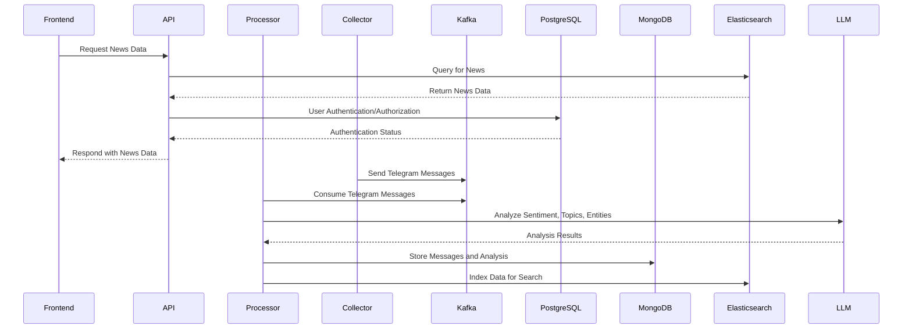

# Telegram News Analyzer

## Overview

The Telegram News Analyzer is a system designed for collecting, analyzing, and visualizing news data from Telegram channels. It employs a microservice architecture to ensure scalability and reliability in data processing. The system consists of several components including a collector, processor, API, and frontend, each containerized with Docker.

## Key Features

-   **Data Collection**: Monitors public and private Telegram channels using the Telethon API.
-   **Text Analysis**: Utilizes natural language processing techniques for extracting key information.
-   **Sentiment Analysis**: Determines the emotional tone of news messages.
-   **Topic Modeling**: Automatically identifies trending topics.
-   **Visualization**: Provides interactive dashboards for data visualization.

## Architecture


Components
Collector: Collects data from Telegram channels and sends messages to Kafka. See src/collector/telegram_collector.py.
Processor: Consumes messages from Kafka, performs analysis, and stores results in MongoDB and Elasticsearch. See src/processor/news_processor.py.
API: Provides a REST API for accessing processed data and managing the system. See src/api/app.py and src/api/routes.py.
Frontend: Offers a web interface for interacting with the system. See src/frontend/app.py.
Infrastructure
PostgreSQL: Stores structured data such as user information and settings.
MongoDB: Stores messages and analysis results.
Elasticsearch: Provides full-text search and fast data access.
Kafka: Facilitates message exchange between components.
Docker: Containerizes and deploys services.
Setup
Clone the repository:
```
git clone <repository_url>
cd yussdan-telenews-analyzer/telegram-news-analysis
```
Configure environment variables:

Create a .env file based on the .env.example file.
Fill in the Telegram API credentials, database URIs, and other settings.
Run the setup script:
```
bash setup.sh
```
This script builds and starts the Docker containers using docker-compose.

Usage
```
Access the web interface at http://localhost:8080.
Use the API endpoints to retrieve data and manage the system.
Check the logs for each service using docker-compose logs -f <service_name>.
```
